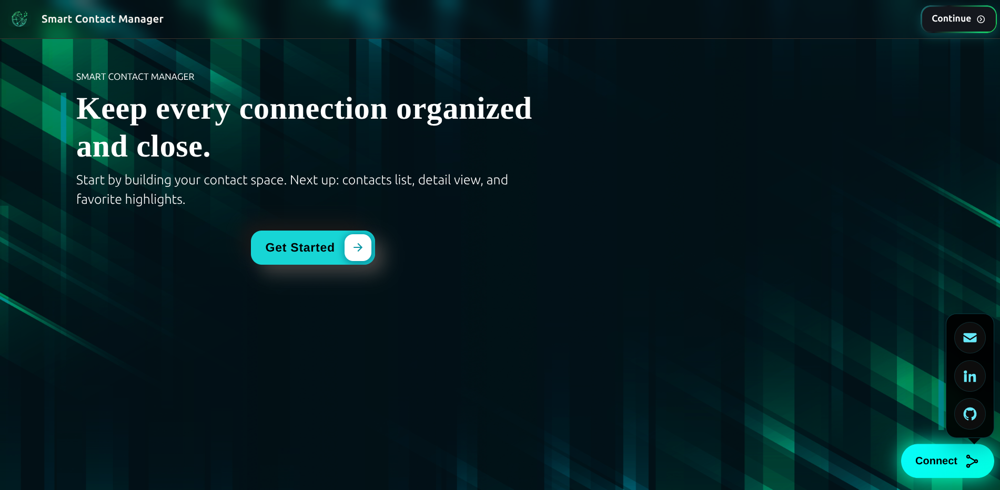
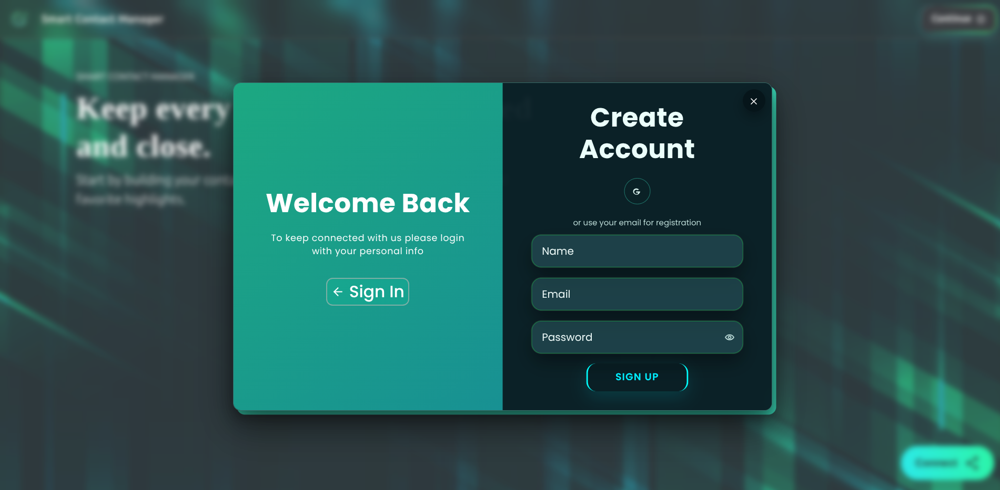
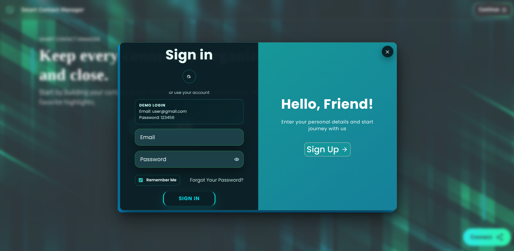
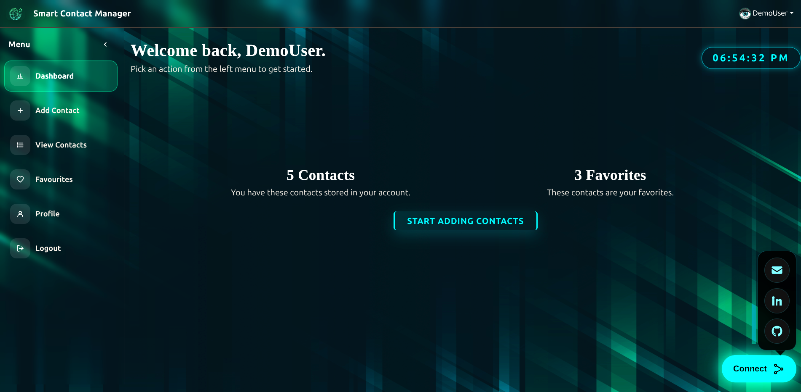
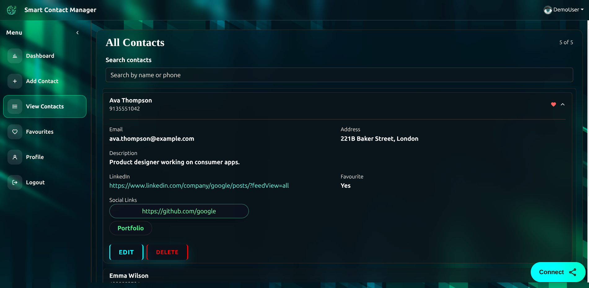
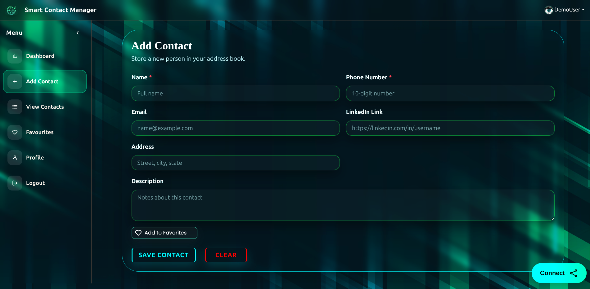

# Smart Contact Manager Frontend

## 🚀 Live Demo

### 🌐 Launch the Application
👉 **[Open Smart Contact Manager](https://scmfrontendmkn.vercel.app/)**

**Direct URL (copy if link doesn't open):**
https://scmfrontendmkn.vercel.app/

---

## 📸 Screenshots

<table>
<tr>
<td align="center"><b>🏠 Home</b></td>
<td align="center"><b>🔐 Login</b></td>
<td align="center"><b>📝 Sign In</b></td>
</tr>

<tr>
<td></td>
<td></td>
<td></td>
</tr>

<tr>
<td align="center"><b>📊 Dashboard</b></td>
<td align="center"><b>👥 Contacts</b></td>
<td align="center"><b>➕ Add Contact</b></td>
</tr>

<tr>
<td></td>
<td></td>
<td></td>
</tr>
</table>

---

## 🛠 Backend Repository

Smart Contact Manager backend source code:

👉 **[SCM Backend Repository](https://github.com/Kaif-Nazir/scm_backend/)**

**Direct URL (copy if link doesn't open):**
https://github.com/Kaif-Nazir/scm_backend/

---

React + Vite frontend for Smart Contact Manager.

## Environment

- Copy `.env.example` to `.env` and update values for your environment.
- For Docker, `VITE_*` values are baked at image build time.
- Social links use:
  - `VITE_CONTACT_EMAIL`
  - `VITE_GITHUB_REPO_URL`
  - `VITE_LINKEDIN_URL`

## Scripts

- `npm run dev` - start local development server
- `npm run build` - create production build in `dist/`
- `npm run preview` - preview production build locally
- `npm run lint` - run ESLint

## Docker

- Build and run with Compose:
  - `docker compose up --build -d`
- Stop:
  - `docker compose down`
- App URL:
  - `http://localhost:5173`

## Size Optimization Notes

- Keep only production dependencies in deployment images with:
  - `npm ci --omit=dev`
- Remove local build artifacts when not needed:
  - `rm -rf dist`
- If you need to reclaim local disk from packages:
  - `rm -rf node_modules && npm ci`
